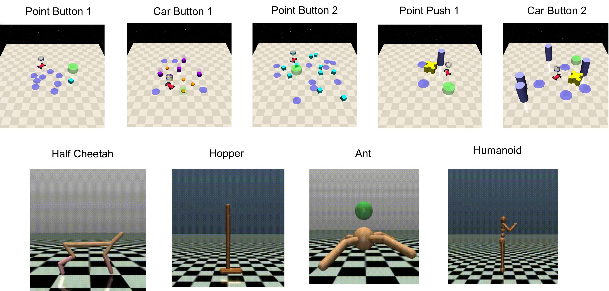

# Augmented Lagrangian-Guided Diffusion (ALGD)

<p align="center">

</p>

### Abstract

Diffusion policy sampling enables reinforcement learning (RL) to represent multimodal action distributions beyond suboptimal unimodal Gaussian policies. However, existing diffusion-based RL methods primarily focus on offline setting for reward maximization, with limited consideration of safety in online settings.
To address this gap, we propose **Augmented Lagrangian-Guided Diffusion** (**ALGD**), a novel algorithm for off-policy safe RL. By revisiting optimization theory and energy-based modeling, we show that the instability of primal–dual methods arises from the non-convex Lagrangian landscape. In diffusion-based RL, the Lagrangian naturally serves as an energy function guiding the denoising dynamics, but directly using it leads to unstable policy generation and training.
ALGD resolves this issue by introducing an augmented Lagrangian that locally convexifies the energy landscape, yielding a stabilized policy generation and training, without altering the distribution of optimal policy. Theoretical analysis and extensive experiments demonstrate that ALGD is both theoretically grounded and empirically effective, achieving strong and stable performance across diverse environments.

### Code Structure

```bash
ALGD/
├── agents/
│   ├── algd/
│   │   ├── ALGD_DDPM.py                     # DDPM type ALGD agent
│   │   ├── ALGD_VESDE.py                    # VE-SDE type ALGD agent
│   │   ├── DDPM.py                          # DDPM diffusion model
│   │   ├── VESDE.py                         # VE-SDE diffusion model
│   │   └── utils.py
│   ├── base_agent.py
│   └── replay_memory.py
│
├── configs/                                 # Experiment configurations
│   ├── algd_ddpm.py
│   └── algd_vesde.py
│
├── env/                                     # Experiment Environment wrappers
│   ├── constraints.py
│   └── safety-gym/
│
├── sampler/
│   ├── mujoco_env_sampler.py
│   └── safetygym_env_sampler.py
│
├── LICENSE
├── main.py                                   # Core Experiment entry: loads config, builds env, train agents.
└── README.md
```

### Install Dependencies

#### Safety-Gym

```shell
cd ./env/safety-gym/
pip install -e .
```

We follow the environment implementation in the [CVPO repo](https://github.com/liuzuxin/cvpo-safe-rl/tree/main/envs/safety-gym) to accelerate the training process. All the compared baselines in the paper are also evaluated on this environment. For further description about the environment implementation, please refer to Appendix B.2 in the [CVPO paper](https://arxiv.org/abs/2201.11927).

### Experiments

<p align="center">

</p>

### Training
For Safety-Gym tasks:

##### DDPM:

```shell
python main.py --agent algd_ddpm --env_name Safexp-PointButton1-v0 --experiment_name pointbutton1_ddpm_algd --num_epoch 250
```

##### VE-SDE:

```shell
python main.py --agent algd_vesde --env_name Safexp-PointButton1-v0 --experiment_name pointbutton1_vesde_algd --num_epoch 250
```

For MuJoCo tasks:

##### DDPM:

```shell
python main.py --agent algd_ddpm --env_name Ant-v3 --experiment_name ant_ddpm_algd --num_epoch 200
```

##### VE-SDE:

```shell
python main.py --agent algd_vesde --env_name Ant-v3 --experiment_name ant_vesde_algd --num_epoch 200
```

<!-- ## Paper Link and Citation

**Paper:** [Information Shapes Koopman Representation](https://arxiv.org/abs/2510.13025)

If you find this work useful in your research, please consider citing:

```bibtex
@misc{cheng2025informationshapeskoopmanrepresentation,
      title={Information Shapes Koopman Representation}, 
      author={Xiaoyuan Cheng and Wenxuan Yuan and Yiming Yang and Yuanzhao Zhang and Sibo Cheng and Yi He and Zhuo Sun},
      year={2025},
      eprint={2510.13025},
      archivePrefix={arXiv},
      primaryClass={cs.LG},
      url={https://arxiv.org/abs/2510.13025}, 
}
``` -->

## Contact

If you encounter any issues, please open an issue on GitHub.